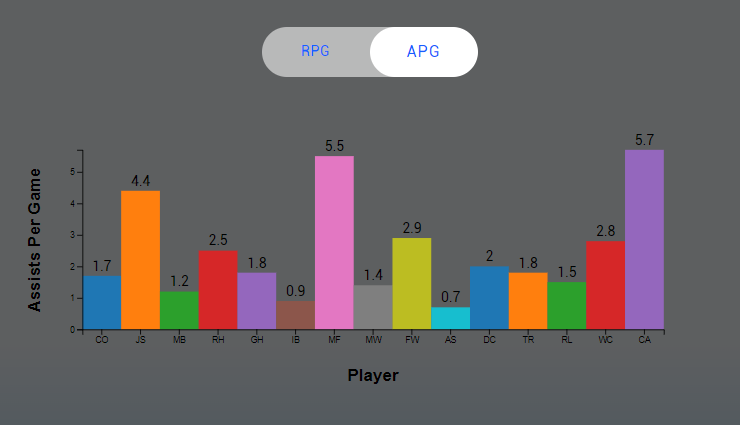

# Orlando Magic Analytics

<p align="center">
  <a href="https://skillicons.dev">
    
  </a>
</p>

Just was a speed run through of the broad space that was mentioned in the Software Engineer - Basketball Analytics position for the Orlando Magic team.  

## Built with: 

### Front-End
[](https://skillicons.dev)

### Back-End
[](https://skillicons.dev)

## Documentation

## D3js Library
[D3js](https://d3js.org/)
Utilized open source datasets of NBA player stats to be able to practice data visualization for the Orlando Magic. 
<p align="center">
    
</p>

### Donut Chart - Points Per Game
Connected front-end to back-end API point that used mySQL & knex.js to query the data for players and their PPG score. The players names are noted by their initials.
<p align="center">
    
</p>

### Bar Graph - Assists & Rebounds Per Game 
Connected front-end to back-end API points to have an interactive bar chart that switches data on toggling of a button. The component uses React Hooks to accomplish this change, with the initial state being Rebounds Per Game and toggles to Assists Per Game. Players names are denoted by their initials.
<p align="center">
    
</p>
<p align="center">
    
</p>


## Available Scripts

In the project directory, you can run:

### `npm start`

Runs the app in the development mode.\
Open [http://localhost:3000](http://localhost:3000) to view it in your browser.

The page will reload when you make changes.\
You may also see any lint errors in the console.

## Run Locally

### Dashboard Analytics Client
Clone the project

```bash
  git clone https://github.com/Nicholas-Nguyen8742/Orlando-Magic-Dashboard
```

Go to the project directory

```bash
  cd vertigo-network-client
```

Install dependencies

```bash
  npm install
```
### Dashboard Analytics Server
Clone the project

```bash
  git clone https://github.com/Nicholas-Nguyen8742/Orlando-Magic-Dashboard-Server
```

Go to the project directory

```bash
  cd vertigo-network-server
```

Install dependencies

```bash
  npm install
```

Run knex migrations & seeds to setup & populate the mySQL server.
```bash
    npx knex migrate:latest
    npx knex seed:run
```

Run the script on vertigo-network-server terminal.
```bash
    node index.js
```


